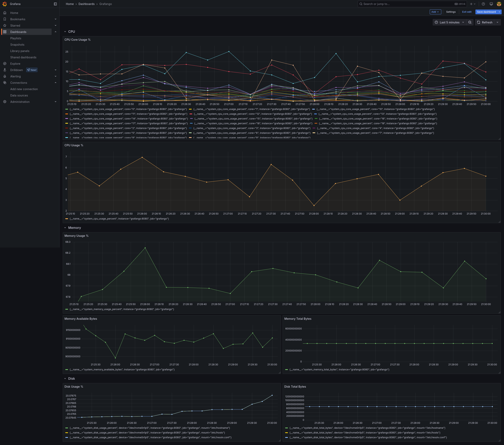

# **Grafango: System Metrics Monitoring with Go, Prometheus & Grafana**

**Grafango** is a simple Go-based application that collects real-time system metrics like CPU and memory usage using the `gopsutil` library and exposes them as Prometheus metrics. The application also integrates with **Prometheus** for data collection and **Grafana** for dashboard visualization. This project helps you set up a basic monitoring stack with these popular tools.



## **Prerequisites**

Before you begin, ensure you have the following tools installed:

- [Docker](https://www.docker.com/)
- [Docker Compose](https://docs.docker.com/compose/)

## **Setup & Installation**

1. **Clone the repository**

   First, clone the repository to your local machine:

    ```bash
    git clone https://github.com/yourusername/grafango.git
    cd grafango
    ```

2. **Run the Services**

    To start the services do:

    ```bash
    docker compose -f deployments/docker-compose.yml up -d
    ```

3. **Stop the Services**
    To stop the services do:

    ```bash
    docker compose -f deployments/docker-compose.yml down
    ```

4. **Accessing Applications**

In order to access applications head to the following pages:

- **Grafango**: [http://localhost:8080](http://localhost:8080)
- **Prometheus**: [http://localhost:9090/](http://localhost:9090/)
- **Grafana**: [http://localhost:3000](http://localhost:3000)

Grafana `user` and `password` are `admin`.

To see the dashboards go to the `Dashboard` section in the Grafana application.
